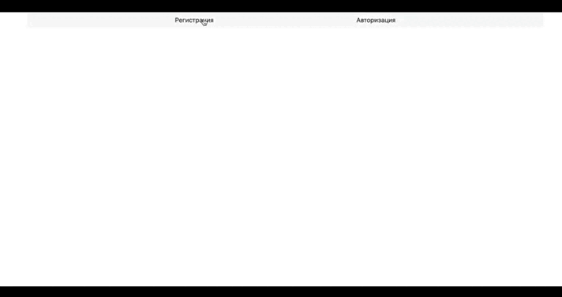

# Holodos
## Идея

Посмотри на визуализацию того, как должно выглядеть приложение (Рисунок 1). Зелёная стрелка на рисунке показывает нажатия пользователя. На главной странице мы видим интерфейс постамата и сами ящики с заказами. 

- При вводе кода в левой части приложения, рядом с соответствующим ящиком в правой части появляется кнопка Open; 
- Поиск подходящей посылки происходит путём сверки введённого кода с тем кодом, который указан в объекте посылки;
- При нажатии на кнопку Open открывается детальная страница с заказом и кнопкой Забрать;
- При нажатии на кнопку забрать, посылка считается выданной человеку, и должна исчезнуть из постамата.
